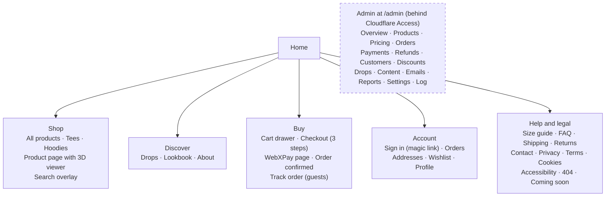

# Sitemap

The store has about 30 pages in five areas, plus a private admin with its own login.

```mermaid
flowchart TD
  Home --> Shop & Discover & Buy & Account & Help
  Shop["Shop<br/>All products · Tees · Hoodies<br/>Product page with 3D viewer<br/>Search overlay"]
  Discover["Discover<br/>Drops · Lookbook · About"]
  Buy["Buy<br/>Cart drawer · Checkout (3 steps)<br/>WebXPay page · Order confirmed<br/>Track order (guests)"]
  Account["Account<br/>Sign in (magic link) · Orders<br/>Addresses · Wishlist · Profile"]
  Help["Help and legal<br/>Size guide · FAQ · Shipping · Returns<br/>Contact · Privacy · Terms · Cookies<br/>Accessibility · 404 · Coming soon"]
  Admin["Admin at /admin (behind Cloudflare Access)<br/>Overview · Products · Pricing · Orders<br/>Payments · Refunds · Customers · Discounts<br/>Drops · Content · Emails · Reports · Settings · Log"]
  style Admin stroke-dasharray: 5 5
```

The admin (dashed) is not linked from the store; only approved staff emails can open it.
