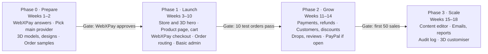

# Roadmap, costs and open questions

The store can go live in about 10 weeks if WebXPay approves early; the dates are estimates for part-time work with Claude and will move with your time.

Each gate must pass before the next phase starts. The launch gate is 10 real test orders (both providers, USD and GBP, one refund) going end to end.

### Running costs (estimates)

| Item | Cost | Notes |
| --- | --- | --- |
| Cloudflare Workers Paid | $5 per month | Recommended: the free plan’s 10 ms CPU limit is tight for checkout and sync |
| D1, R2, Access, Queues | $0 to a few dollars per month | Free tiers cover a new store |
| Domain | About $10–15 per year | Check charflut.com availability |
| WebXPay | Rs.10,000 per year + Rs.5,000 USD/GBP activation, about 4.85% per foreign card payment | From their pricing page; confirm with WebXPay |
| Email service | $0 on a free tier at launch | Paid when volume grows |
| Printify or Printful | $0 to start; you pay only per order | Printify Premium is optional later |
| 3D garment models | About $50–300 each, one-off | Get quotes |
| Product samples | Cost of 4–6 garments + shipping | Needed for real photos and quality checks |

### Open questions

- [ ] Main provider for tees and hoodies at launch: Printify or Printful?
- [ ] WebXPay written answers: POD accepted, server notification, refund API, GBP payout
- [ ] Tagline: “Clean cuts. Bold prints.” or another option
- [ ] Domain name and business email
- [ ] First collection: how many designs, and who creates the artwork
- [ ] Returns policy for UK customers, after legal advice
- [ ] UK VAT registration timing, after accounting advice
